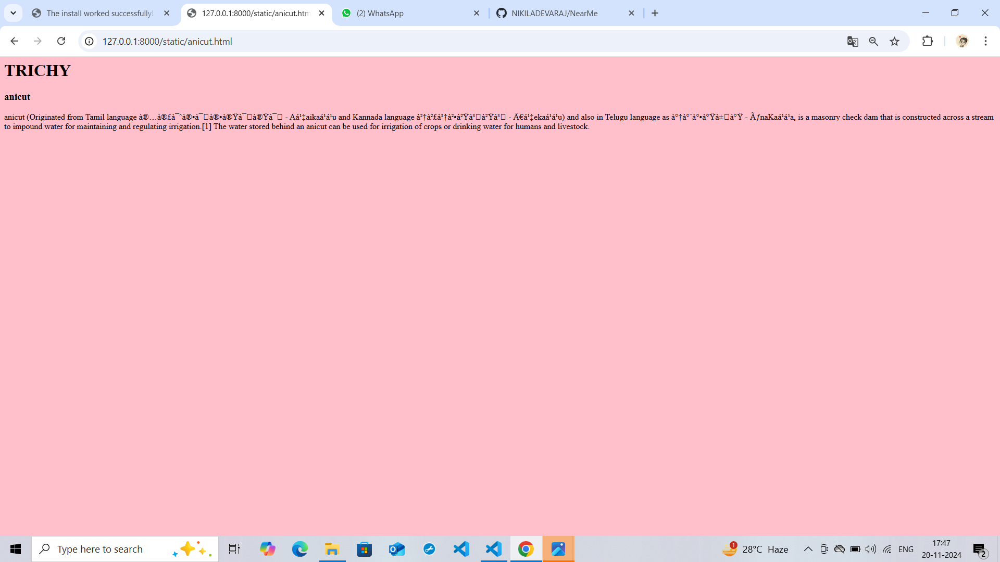

# Ex04 Places Around Me
## Date: 20/11/2024

## AIM
To develop a website to display details about the places around my house.

## DESIGN STEPS

### STEP 1
Create a Django admin interface.

### STEP 2
Download your city map from Google.

### STEP 3
Using ```<map>``` tag name the map.

### STEP 4
Create clickable regions in the image using ```<area>``` tag.

### STEP 5
Write HTML programs for all the regions identified.

### STEP 6
Execute the programs and publish them.

## CODE
```
map.html
<html>
<body>
    <h1>TRICHY</h1>
    <h2>NIKILA D(24900699)</h2>


<map name="image-map">
    <area target="" alt="Ranganatham " title="Ranganatham " href=" ranganathan.html" coords="883,169,1153,244" shape="rect">
    <area target="" alt="Panjappur" title="Panjappur" href="panjappur.html" coords="949,703,107" shape="circle">
    <area target="" alt="Airport" title="Airport" href="airport.html" coords="1246,580,1389,567,1378,709,1239,694,1241,694,1240,694,1244,581" shape="poly">
    <area target="" alt="Anicut" title="Anicut" href="anicut.html" coords="1541,325,1671,404" shape="rect">
    <area target="" alt="vayalur" title="vayalur" href="vayalur.html" coords="773,327,112" shape="circle">
</map>
</body>
</html>
airport.html
<html>
    <body bgcolor="yellow">
        <h1>TRICHY</h1>
       <h>airport</h1>
        <p>Tiruchirappalli International Airport (IATA: TRZ, ICAO: VOTR) is an international airport serving Tiruchirappalli in the Indian state of Tamil Nadu. The airport, spread over an area of 702.02 acres (284.10 ha), is located on National Highway 336, about 5 km (3.1 mi) south of the city centre.[4] </p>
    </body>
</html>
anicut.html
<html>
    <body bgcolor="pink">
        <h1>TRICHY</h1>
        <h3>anicut</h3>
        <p> anicut (Originated from Tamil language அணைக்கட்டு - Aṇaikaṭṭu and Kannada language ಆಣೆಕಟ್ಟು - Āṇekaṭṭu) and also in Telugu language as ఆనకట్ట - ÃnaKaṭṭa, is a masonry check dam that is constructed across a stream to impound water for maintaining and regulating irrigation.[1] The water stored behind an anicut can be used for irrigation of crops or drinking water for humans and livestock. </p>
    </body>
</html>
panjappur.html
<html>
    <body bgcolor="red">
        <h1>TRICHY</h1>
        <h3>panjappur</h3>
<p> Panjapur is an area of Tiruchirappalli suburbs of Edamalaipatti Pudur of Trichy in Tamil Nadu, India. It comes under the city limit with Tiruchirappalli city corporation and Tiruchirappalli West taluk. Ward 39 of Trichy corporation covers Panjapur.</p>
    </body>
</html>
ranganathan.html
<html>
    <body bgcolor="cyan">
        <h1> TRICHY </h1>
        <h3>ranganathan</h3>
        <p>The Ranganathaswamy Temple is a Hindu temple dedicated to Ranganatha (a form of Vishnu) and his consort Ranganayaki (a form of Lakshmi). The temple is located in Srirangam, Tiruchirapalli, Tamil Nadu, India.[4] Constructed in the Dravidian architectural style, the temple is glorified by the Tamil poet-saints called the Alvars in their canon, the Naalayira Divya Prabhandam,[5] and has the unique distinction of being the foremost among the 108 Divya Desams dedicated to the god Vishnu.</p>
    </body>
</html>
vayalur.html
<html>
    <body bgcolor="blue">
        <h1>
            TRICHY
        </h1>
        <h3>vayalur</h3>
        <p>The Vayalur Murugan Temple is a Hindu temple dedicated to Muruga, son of Lord Shiva and Parvati, located in the village of Kumaravayalur in Tiruchirapalli district, Tamil Nadu, India. The temple is believed to have been initiated during the period of Medieval Cholas during the 9th century</p>
    </body>
</html>
```

## OUTPUT





## RESULT
The program for implementing image maps using HTML is executed successfully.
